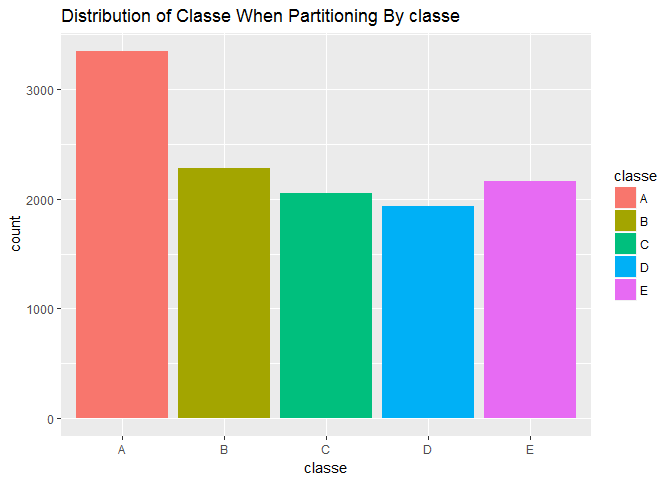
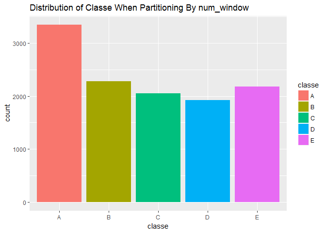

# Practical Machine Learning Course Project
Wayne Heller  
June 17, 2017  


## Overview
The goal of this project is to create a prediction model to classify whether a study participant is correctly performing an exercise or if he/she is making a typical mistake in form.   The data is from accelerometers and other measurement devices on the belt, forearm, arm, and dumbell of 6 participants. They were asked to perform barbell lifts correctly and incorrectly in 5 different ways. 

The following description comes directly from the Coursera assignment:  

Using devices such as Jawbone Up, Nike FuelBand, and Fitbit it is now possible to collect a large amount of data about personal activity relatively inexpensively. These type of devices are part of the quantified self movement – a group of enthusiasts who take measurements about themselves regularly to improve their health, to find patterns in their behavior, or because they are tech geeks. One thing that people regularly do is quantify how much of a particular activity they do, but they rarely quantify how well they do it.  

More information is available from the website here: http://groupware.les.inf.puc-rio.br/har (see the section on the Weight Lifting Exercise Dataset).

## Executive Summary
Using a Random Forest model, I was able to achieve an accuracy of 99.86% with a 95% confidence interval of (0.9975, 0.9993) on the data provided.  Applying this model to the validation dataset resulted in a score of 100 prediction accuracy%  My attempt to aggregate the data to simplify the computational intensity resulted in an overfitted model that was not selected.

## Data Preparation and Partitioning
The potential features in this dataset include direct measurements of sensors as well as various summarizations of those measurements such as min, max, variance, kurtosis, etc. aggregated over what I assume is 2.5 second windows.  I came to this conclusion by reading the initial experimenter's report.  There are several issues with the summarization data, the largest is that it appears that it is mapped incorrectly.  For example, max_roll_belt appears to contain the summarization of max_yaw_belt.  There is also a feature called "new_window" and another named "num_window" that appear to indicated when a new set of aggregation has occurred; however, these two are not insync.  Specifically, all changes in num_window are not indicated by a new_window value of 'yes'.  In addition, the validation dataset for this assignment contains just a very small sample (20) of sensor measurements, so using the summary info would be problematic.  

**CONCLUSION: Drop the summarization columns from potential feature selection.**  

Another challenge is that there is a lot of sensor data, over 19,600 rows of it, which makes fitting a model such as random forest computationally intensive for my aging laptop.  Much of this sensor data is subsequent readings of the same activity sampled at a very rapid rate.  An approach to simplify the dataset is to aggregate measurments using median by the num_windows, after validating that num_window is unique to classe.  

In order to compare the accuracy of models using the aggregation approach to the raw data approach, I needed to find a way to partition the data such that I could get an apples to apples comparison.  

**CONCLUSION: I determined that there is a 1:1 relationship between num_window and classe and that partitioning on num_window give me a roughly equivalent distribution across classe.  See below** 


```r
num_window_A <- unique(training[training$classe=='A', ]$num_window)
num_window_B <- unique(training[training$classe=='B', ]$num_window)
num_window_C <- unique(training[training$classe=='c', ]$num_window)
num_window_D <- unique(training[training$classe=='D', ]$num_window)
num_window_E <- unique(training[training$classe=='E', ]$num_window)
Reduce(intersect, list(num_window_A, num_window_B, num_window_C, num_window_D, num_window_E))
```

```
## integer(0)
```

### Split the training dataset into training and testing

First onfirm that splitting on num_window gives me the approximately the same distribution as splitting on classe


```r
inTrain <- createDataPartition(training$classe, p=.6, list=FALSE)
measurementrows.training <- training[inTrain, ]
measurementrows.testing <- training[-inTrain, ]
qplot(x = classe, data=measurementrows.training, fill=classe, main="Distribution of Classe When Partitioning By classe")
```

<!-- -->

```r
inTrain <- createDataPartition(training$num_window, p=.6, list=FALSE)
measurementrows.training <- training[inTrain, ]
measurementrows.testing <- training[-inTrain, ]
qplot(x = classe, data=measurementrows.training, fill=classe, main="Distribution of Classe When Partitioning By num_window")
```

<!-- -->

**Identify measurement columns from summary columns from identification columns**


```r
summary.col.name.prefixes <- "kurtosis|skewness|max|min|var|amplitude|var|avg|stddev"
summary.col.names <- names(training)[grepl(summary.col.name.prefixes, names(training))]

id.col.names <- "X|user_name|raw_timestamp_part_1|raw_timestamp_part_2|cvtd_timestamp|new_window|num_window|classe"

measurement.col.names <- names(training)[!grepl(summary.col.name.prefixes, names(training)) & !grepl(id.col.names, names(training))]
```

**Create testing and training datasets based on aggregation by num_window and classe**


```r
aggregatedrows <- aggregate(training[ , c(measurement.col.names)], by=list(training$num_window, training$classe), FUN = median, na.rm=TRUE)
names(aggregatedrows)[1:2] <- c("num_window", "classe")
```

**Here's where some magic happens.**  
Split into training and testing based on prior partition to keep apples to apples, this is why I needed to partition the data on num_window


```r
measurementrows.training.num_windows <- unique(measurementrows.training$num_window)
measurementrows.testing.num_windows <- unique(measurementrows.testing$num_window)

aggregatedrows.training <- aggregatedrows[aggregatedrows$num_window %in% measurementrows.training.num_windows , ]

aggregatedrows.testing <- aggregatedrows[aggregatedrows$num_window %in% measurementrows.testing.num_windows, ]
```

**TO CLARIFY:  **  
At this point there are two training and two test data.frames build of of the pml-training.csv data set:  
**measurementrows.training, measurementrows.testing** contain all 19,600+ rows  
**aggregatedrowss.training, aggregatedrows.testing** contain the median of all sensor measurements aggregated by num_window  

**See section above for why I believe aggregating and partitioning on num_window is a valid approach and Conclusion below where this approach dead ended.**

## MODEL CREATION AND SELECTION
Approach: Build 6 models using Random Forest (rf), Gradient Boosting (gbm), and Classification Trees (rpart) and test with both datasets.  For feature selection, after removing the summary columns, I chose to build the models off of the raw sensor data columns.


```r
# Random Forest
modFit.rf <- train(classe ~ ., method="rf", data = measurementrows.training[, c("classe", measurement.col.names)])
confusionMatrix(predict(modFit.rf, measurementrows.testing) , measurementrows.testing$classe)$overall[1]
```

```
##  Accuracy 
## 0.9918451
```

```r
modFit.rf$finalModel
```

```
## 
## Call:
##  randomForest(x = x, y = y, mtry = param$mtry) 
##                Type of random forest: classification
##                      Number of trees: 500
## No. of variables tried at each split: 2
## 
##         OOB estimate of  error rate: 0.86%
## Confusion matrix:
##      A    B    C    D    E class.error
## A 3343    2    0    1    1  0.00119510
## B   18 2253    6    0    0  0.01054018
## C    0   18 2019   10    0  0.01367855
## D    0    0   40 1886    2  0.02178423
## E    0    0    0    3 2172  0.00137931
```

```r
modFit.aggregated.rf <- train(classe ~ ., method="rf", data = aggregatedrows.training[, c("classe", measurement.col.names)])
confusionMatrix(predict(modFit.aggregated.rf, aggregatedrows.testing), aggregatedrows.testing$classe)$overall[1]
```

```
##  Accuracy 
## 0.9976553
```

```r
modFit.aggregated.rf$finalModel
```

```
## 
## Call:
##  randomForest(x = x, y = y, mtry = param$mtry) 
##                Type of random forest: classification
##                      Number of trees: 500
## No. of variables tried at each split: 2
## 
##         OOB estimate of  error rate: 10.98%
## Confusion matrix:
##     A   B   C   D   E class.error
## A 236   3   1   2   0  0.02479339
## B  20 136  10   1   0  0.18562874
## C   0  13 136   2   0  0.09933775
## D   2   0  17 116   6  0.17730496
## E   0   7   5   5 138  0.10967742
```

```r
# Gradient Boosting
modFit.gbm <- train(classe ~ ., method="gbm", verbose=FALSE, data = measurementrows.training[, c("classe", measurement.col.names)])
confusionMatrix(predict(modFit.gbm, measurementrows.testing) , measurementrows.testing$classe)$overall[1]
```

```
##  Accuracy 
## 0.9589704
```

```r
modFit.aggregated.gbm <- train(classe ~ ., method="gbm", verbose=FALSE, data = aggregatedrows.training[, c("classe", measurement.col.names)])
confusionMatrix(predict(modFit.aggregated.gbm, aggregatedrows.testing) , aggregatedrows.testing$classe)$overall[1]
```

```
##  Accuracy 
## 0.9988277
```

```r
# Classification Tree
modFit.rpart <- train(classe ~ ., method="rpart", data = measurementrows.training[, c("classe", measurement.col.names)])
confusionMatrix(predict(modFit.rpart, measurementrows.testing) , measurementrows.testing$classe)$overall[1]
```

```
##  Accuracy 
## 0.4915902
```

```r
modFit.aggregated.rpart <- train(classe ~ ., method="rpart", data = aggregatedrows.training[, c("classe", measurement.col.names)])
confusionMatrix(predict(modFit.aggregated.rpart, aggregatedrows.testing) , aggregatedrows.testing$classe)$overall[1]
```

```
##  Accuracy 
## 0.5111372
```

```r
# Loading required package: rpart
# Accuracy 
#0.4933741 
# Accuracy 
#0.5123384
```
### Cross Validation
A requirement of this project is a discussion of cross validation methods used.  The default method of bootstrapped sampling built into the caret package provided very high accuracy so it was sufficient for this purpose.  Had I not run out of time, I would have experimented with changing the defaults to better understand the impact.

## CONCLUSION
1) Aggregating the sensor data by num_window produced a model with greater accuracy on the testing dataset and less computational intensity than using the full dataset of measurements; however, the results on the validation dataset were less accurate (80% compared to 100%), indicating overfitting of the model to the training data.  One indication of this overfitting is in the OOB Error Rates for the Random Forrest models.  For the non-aggregated model OOB error is 0.83% and for the aggregated data OOB error rate is 11.33%

2) The Random Forest and Gradient Boosting approaches yeilded high accuracy in comparison to the classification tree approach.  

3) Prediction on validation dataset using the Random Forest model:

```r
predict(modFit.rf, validation)
```

```
##  [1] B A B A A E D B A A B C B A E E A B B B
## Levels: A B C D E
```

```r
predict(modFit.aggregated.rf, validation)
```

```
##  [1] B A A A A E D B A A B C B A E E A B B B
## Levels: A B C D E
```

The submission of the modFit.rf prediction resulted in a score of 20/20 100%.
